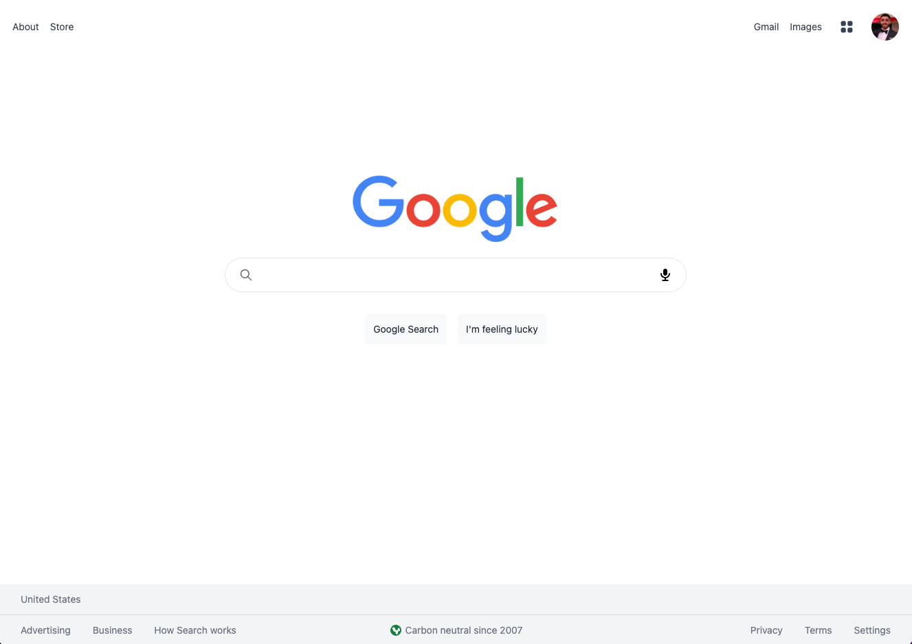
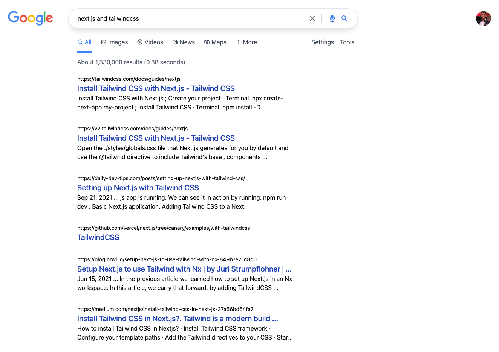
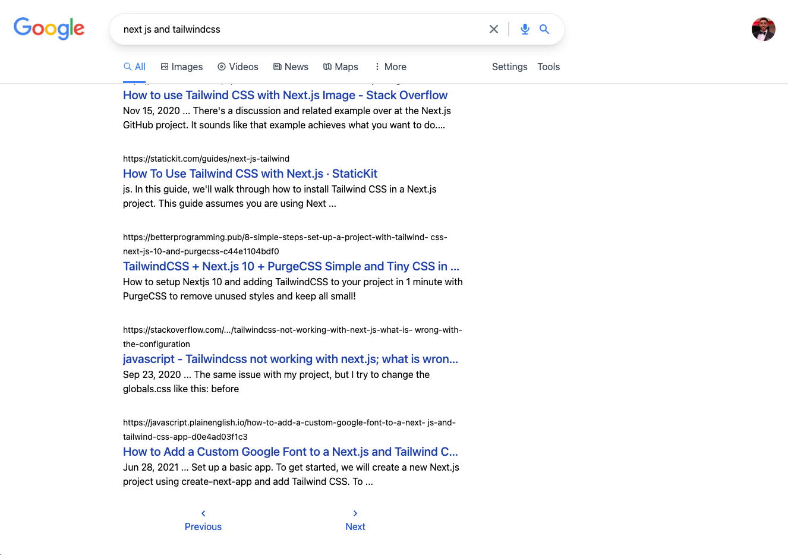

# Google Clone
> Built with Next, Tailwind CSS and the Google Search API. Based on Sonny Songha's Google Clone tutorial.
> Live demo [_here_](https://google-clone-vert-nu.vercel.app).

## Table of Contents
* [General Info](#general-information)
* [Technologies Used](#technologies-used)
* [Features](#features)
* [Screenshots](#screenshots)
* [Project Status](#project-status)
* [Room for Improvement](#room-for-improvement)
* [Acknowledgements](#acknowledgements)

## General Information
- More experience with React and Next using a basic Google Search template. Important introduction into APIs from Google and implementation of Server Side Rendering via Next.js. Implementation of Tailwind is always fun and each static clone I build is only more practice under my belt.

## Technologies Used
- Next - v12.1.5
- React - v18.1.0
- TailwindCSS - v3.0.24

## Features
- Responsive media sizing through Tailwind
- Page routing and pagination through Next Router
- Direct implementation of Google Search API
- CSS Grid implementation for responsive footer

## Screenshots

## Project Status
Project is: _complete_ 

## Room for Improvement
- Does not contain exact pagination design as Google's search page, could look better
- Could implement loading/buffering signal for a better user experience

## Acknowledgements
- This project was based on [this tutorial](https://youtu.be/24xpTmaPOdY) from Sonny Sangha.
